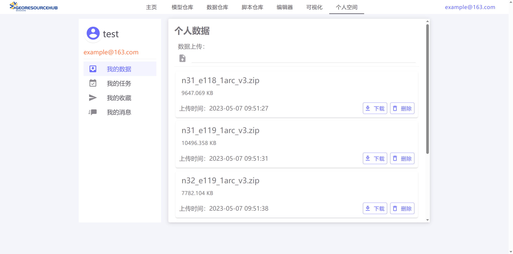

# 流域水文模拟数据综合管理平台

## 1 平台介绍

​        对流域水文模拟过程中涉及到的各类地理数据资源进行了汇总与整理，按照类别和数据格式对地理数据进行标准化描述与表达，结合在线的数据处理方法库，系统提供了一个面向流域水文模拟的数据资源综合管理的平台，旨在促进地理数据资源的共享与复用。

## **2 平台模块**

1. ##### 数据检索

   平台按照流域水文模拟过程中涉及的多样地理数据类型进行划分，提供具有针对性的数据的检索功能。为进行流域水文模拟的研究者提供更加清晰的数据检索方式。

2. ##### 数据可视化

   平台主要管理存储水文模型相关的地理数据资源，同时包含大量常见类型的数据。平台提供数据的在线可视化服务，地理数据格式如Shapefile、GeoTiFF等，普通常用数据如word、pdf等。

3. ##### 描述文档智能编辑

   平台提供具备关键词提示与检查的数据描述文档编辑器，会按照定义好的格式化文档要求，在编辑过程中实时提示与补全文档的元素。

4. ##### 数据处理脚本

   平台提供在线的数据处理方法调用，并且支持用户上传共享个人的数据处理方法，只需按照平台要求进行简单封装即可满足要求。且提供API接口，可以将本平台的数据处理方法共享到其他系统。

5. ##### 个人空间

   个人空间可以管理个人上传的数据、查看数据处理方法的调用状态，下载数据处理方法结果以及与系统后台进行消息通信。未来计划加入与其他用户的直接通信。

## 3 主要技术

​        前端网页使用Vue+Vuetify实现，基于CodeMirror二次开发实现文档编辑器

​        后端使用SpringBoot实现，使用MongoDB作为数据库，使用redis做数据缓存，使用Geoserver作为地理数据发布源，使用Socketio实现用户通信，使用guava做数据处理服务接口的限流控制。


## 4 平台截图

1. ##### 首页

   

2. ##### 模型管理页

   

3. ##### 数据管理页

   

   

4. ##### 脚本仓库页

   

5. ##### 编辑页

   

6. ##### 数据可视化页

   

7. ##### 个人中心页

   

## 5 使用

##### 项目建立

```
npm install
```

##### 启动

```
npm run dev
```

##### 打包

```
npm run build
```

